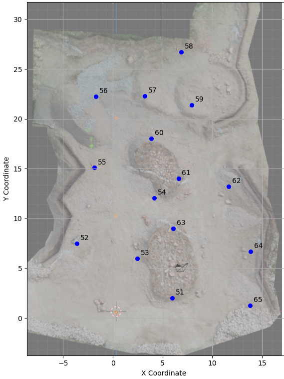
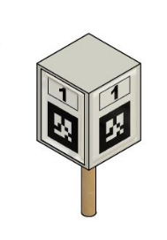
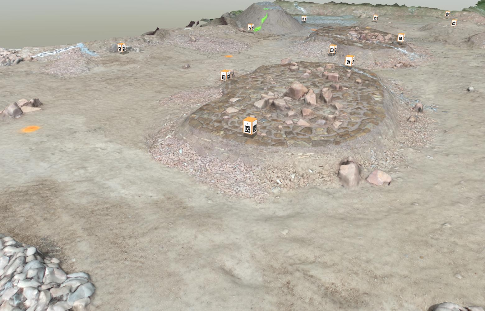
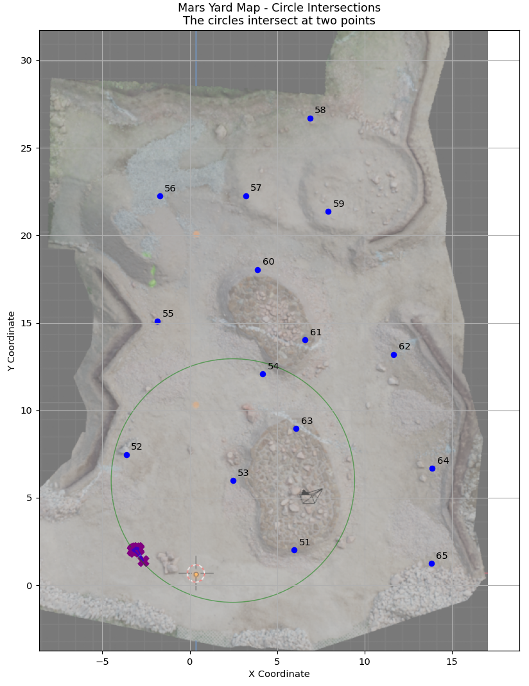
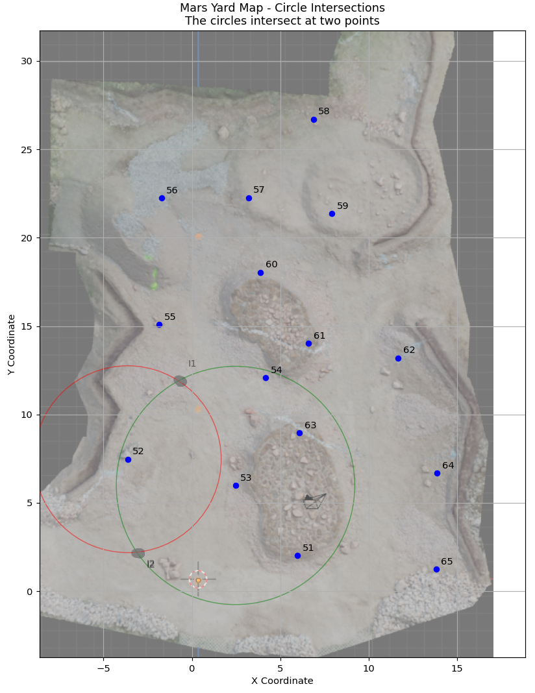
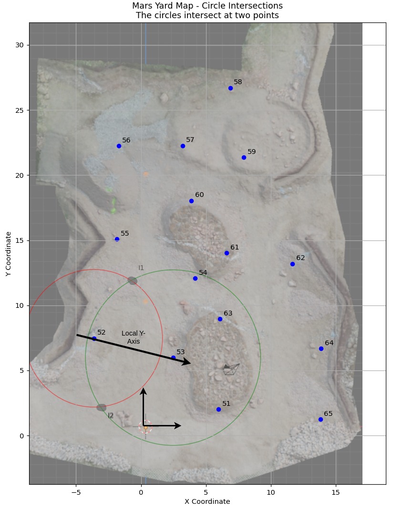
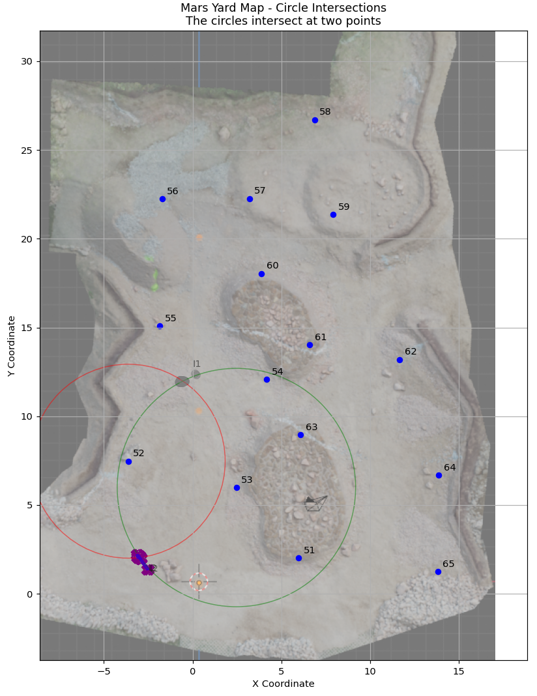
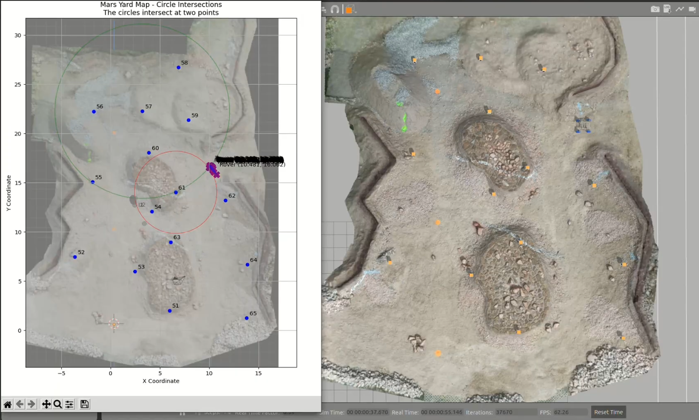

# ArUco Marker Localization

## Problem Statement

In Mars yard simulation environments, rover localization is a critical task for testing autonomous navigation systems. This project addresses the challenge of localizing a rover in a Mars yard using ArUco markers.

<p align="center"><b>Mars Yard</b></p>
<p align="center">
  
</p>

The Mars yard contains several landmarks distributed throughout the environment. Each landmark serves as a reference point for the rover to determine its position. Traditional localization methods often rely on GPS, but in Mars-like environments, we need alternative approaches that mimic the constraints faced on the actual Martian surface.

---

## Limitations of Existing Solutions

Most existing ArUco marker-based localization systems assume a simple **one-to-one relationship** between markers and locations—meaning each marker corresponds to exactly one coordinate in the environment.

<p align="center">
  
</p>

However, in our Mars yard setup, we have a more complex arrangement:

- **Each landmark consists of four ArUco markers** facing in different directions, forming a 3D structure at each coordinate.

<p align="center">
  
</p>
<p align="center"><i>Side View of Mars Yard with ArUco Marker Landmarks</i></p>

This presents several challenges:

- The rover may see multiple markers from different landmarks simultaneously.
- The same landmark might be observed from different angles, presenting different marker faces.
- Distance and orientation calculations become more complex with multiple marker observations.
- Standard ArUco localization libraries aren't designed for this multi-marker-per-landmark scenario.

> These limitations make it difficult to use off-the-shelf solutions for accurate rover localization in our Mars yard environment.

## Solution 1: Localization Using Two ArUco Markers

In this approach, the rover's position is determined using at least **two detected ArUco markers (landmarks)**. The process is as follows:

1. **Circle Construction:**  
   When two markers are detected, a circle is drawn around each landmark. The radius of each circle is the distance from the rover to the respective marker.

   <p align="center">
     
   </p>

2. **Intersection Points:**  
   The intersection of these two circles yields **two possible positions** for the rover.

   <p align="center">
     
   </p>

3. **Disambiguating the Rover's Position:**  
   To select the correct position, we need to relate the rover's local coordinate system to the global coordinate system.  
   - We know the **global coordinates** of the landmarks.
   - In the rover's local frame, a landmark on its left has a negative Y value, and on its right, a positive Y value.
   - By comparing the sign of the Y values, we can create a **directed line** from the negative to the positive marker, establishing the relationship between the local and global Y axes.

   <p align="center">
     
   </p>

4. **Coordinate Transformation:**  
   - Convert the global coordinates of the landmarks to the local frame using the established relationship.
   - Calculate the rover's position in the local frame.
   - Transform the local position back to the global frame.

5. **Selecting the Correct Position:**  
   - Compare the two globally obtained intersection points with the calculated global position.
   - **Select the point with the least difference** as the rover's actual position.

   <p align="center">
     
   </p>

This method ensures robust localization by leveraging geometric relationships and known landmark positions.

## Solution 2: Localization Using One ArUco Marker and IMU

In this approach, the rover's position can be determined using just **one detected ArUco marker (landmark)**, provided that IMU data is available and the relationship between the global and local coordinate systems is established at the start of the operation.

The key difference from the first approach is that, previously, two markers were required to determine the relationship between the rover's local and the global coordinate systems. In this method, the **yaw data from the IMU** is used to continuously track the orientation and maintain the relationship between the local and global frames.

The process is as follows:

1. **Initialization:**  
   - At the start, the relationship between the global and local coordinate systems is established (e.g., by aligning the rover and recording the initial yaw).

2. **Marker Detection:**  
   - When a single ArUco marker is detected, its position is converted into the rover's local coordinate frame.

3. **IMU Integration:**  
   - The IMU provides the current yaw (orientation) of the rover, allowing for accurate transformation between local and global coordinates throughout the operation.

4. **Position Calculation:**  
   - Using the known global position of the detected landmark and the observed local position (distance and angle from the rover), the rover's position is calculated in the local frame.
   - This local position is then transformed into the global coordinate system using the current yaw from the IMU.

This approach enables robust and continuous localization with only one visible landmark, leveraging the IMU to maintain orientation awareness and accurately convert between coordinate systems.

## Code Structure

This repository contains the following main Python files for ArUco-based rover localization:

- **`aruco_marker_detection.py`**  
  Handles ArUco marker detection, pose estimation, and publishing marker transforms and positions.  
  - Change `self.marker_size` for your marker size (meters).
  - Change the camera topic in the `self.image_sub` subscription.
  - Change the camera frame in `transform_msg.header.frame_id`.
  - Update `self.camera_matrix` and `self.dist_coeffs` for your camera calibration.

- **`calculate_position_based_on_2_markers.py`**  
  Implements the solution using two ArUco markers (landmarks) for rover localization.

- **`calculate_position_based_on_yaw.py`**  
  Implements the solution using one ArUco marker (landmark) and IMU yaw data for localization.

### Landmark Coordinates

The global coordinates of each landmark (ArUco marker) are defined in a dictionary within the code:

```python
points_dict = {
    "51": [5.96, 2.009],
    "52": [-3.632, 7.469],
    "53": [2.464, 5.984],
    "54": [4.163, 12.066],
    "55": [-1.854, 15.088],
    "56": [-1.73, 22.246],
    "57": [3.205, 22.268],
    "58": [6.863, 26.711],
    "59": [7.905, 21.371],
    "60": [3.876, 18.039],
    "61": [6.598, 14.024],
    "62": [11.656, 13.19],
    "63": [6.086, 8.967],
    "64": [13.864, 6.67],
    "65": [13.804, 1.249],
}
```
## Demo Video

To see the system in action, watch the demonstration video:

<p align="center">
  <b>ArUco Marker Localization Demo</b><br>
  <a href="https://drive.google.com/file/d/1kRtD-9vlsoaHnq8T8EvH14VKiCUsjrLH/view?usp=sharing" target="_blank">
    
  </a>
</p>

*Click the image above or [this link](https://drive.google.com/file/d/1kRtD-9vlsoaHnq8T8EvH14VKiCUsjrLH/view?usp=sharing) to view the video.*

---

